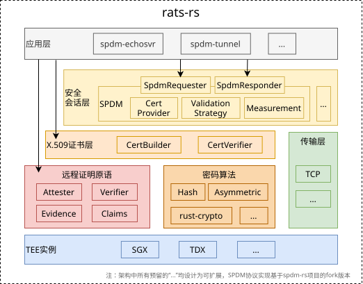

# rats-rs 项目介绍

本文主要介绍 rats-rs 项目的整体架构，以及各模块的功能。

## 整体架构

本项目的架构图如下图所示。



本项目最初的设计上，就尽量考虑实现模块化。图中的上层模块对下层模块与调用依赖关系，而同一层级之间的模块之间则并无依赖关联。

此外，各模块一般有抽象出对应的`trait`类型，并充分利用泛型机制（Generics）和组合设计的模式（Composite）来实现通用性。并在一些方面借助 Cargo.toml 中的的 features 机制来进行条件编译，实现功能裁剪。

图中的最上层为应用程序，相应的示例可以在[这里](/examples/spdm)找到。值得一提的是，rats-rs 为上层应用程序暴露了三个不同层次的 API 接口，从高到低分别为：

- **安全会话层 API**：最常用的 API，可以为上层应用程序提供建立基于远程证明保证的安全会话的层的能力。
- **X.509 证书层 API**：该 API 将暴露带远程证明属性的 X.509 证书证书的生成和验证接口，适用于那些需要 X.509 证书，但对其用途有定制需求的场景。
- **远程证明原语 API**：该 API 可以允许用户用统一的方式使用 TEE 实例提供的远程证明能力，包括 Evidence 数据的获取和验证。

## 模块功能

本项目目前主要包含如下几个模块

### 远程证明原语

该模块包含了不同 TEE 类型对应的远程证明和验证逻辑。在该模块中，项目提供了对不同 TEE 类型的抽象，包括`Attester`、`Verifier`、`Evidence`、`Claims`等。对应的 trait 设计如下：

```rust
/// Trait representing generic evidence.
pub trait GenericEvidence: Any {
    /// Return the CBOR tag used for generating DICE cert.
    fn get_dice_cbor_tag(&self) -> u64;

    /// Return the raw evidence data used for generating DICE cert.
    fn get_dice_raw_evidence(&self) -> &[u8];

    /// Return the type of Trusted Execution Environment (TEE) associated with the evidence.
    fn get_tee_type(&self) -> TeeType;

    /// Parse the evidence and return a set of claims.
    fn get_claims(&self) -> Result<Claims>;
}

/// Trait representing a generic attester.
pub trait GenericAttester {
    type Evidence: GenericEvidence;

    /// Generate evidence based on the provided report data.
    fn get_evidence(&self, report_data: &ReportData) -> Result<Self::Evidence>;
}

/// Trait representing a generic verifier.
pub trait GenericVerifier {
    type Evidence: GenericEvidence;

    /// Verify the provided evidence with the Trust Anchor and checking the report data matches the one in the evidence.
    fn verify_evidence(
        &self,
        evidence: &Self::Evidence,
        report_data: &ReportData,
    ) -> Result<()>;
}

pub type Claims = serde_json::Map<String, serde_json::Value>;

```

每种 TEE 类型只需要提供 trait 对应的实现，即可通过组合的方式和项目中的其它组件协同使用。

对于那些对所使用的具体 TEE 类型并不敏感的上层应用，为了实现对不同 TEE 类型实现的自动适配，我们还提供了`AutoAttester`和`AutoVerifier`类型。该类型能够自动判定当前运行环境中的 TEE 类型，从而向上层应用屏蔽具体 TEE 相关的代码。

> 本项目还以 features 的形式，在编译阶段提供对项目支持的 TEE 类型进行裁剪的能力。这些能力是通过 Cargo.toml 中命名为格式为`attester-*`和`verifier-*`的 features 控制的。

### 密码算法

该模块提供了密码学原语的抽象接口，主要包括各种 Hash 函数、公钥密码算法的支持。该模块和远程证明原语一样，同样属于项目中非常基础的能力之一，会被诸如 X.509 证书层、安全会话层等其他模块调用。

为了方便使用，并降低模块直接的耦合，本模块使用枚举(enum)多态的方式，对同一类型的算法进行了封装，并对外提供一致的功能接口。

目前支持的 Hash 函数有：

- SHA-256
- SHA-384
- SHA-512

支持的公钥密码算法：

- RSA-2048
- RSA-3072
- RSA-4096
- NIST P-256 (secp256r1)

此外，本模块还允许选择这些密码算法的实现后端，这对于一些对性能和资源限制要求较为苛刻的场景提供了更为友好的选项。目前的后端实现基于[RustCrypto](https://github.com/RustCrypto)（通过`crypto-rustcrypto` feature 控制）。未来还将考虑提供基于[ring](https://github.com/briansmith/ring)或者[rust-openssl](https://github.com/sfackler/rust-openssl)的后端实现。

### X.509 证书层

该模块主要提供证书的生成和证书验证逻辑的实现，对外暴露`CertBuilder`和`CertVerifier`两个接口。

本项目参考[Interoperable RA-TLS](https://github.com/CCC-Attestation/interoperable-ra-tls)草案，设计了一种将远程证明 Evidence 和 X.509 证书结合的自签名证书模式，我们将其简称为 DICE 证书，具体的细节在[这份](/docs/core-design-of-cpu-spdm.md)文档中进行了叙述。

### 传输层

传输层模块主要为安全会话层服务，因为安全会话层的数据传输需要建立在传输层之上，因此它它可以看作是一个比较简单的薄层。

具体来说，针对安全会话层运行的是 SPDM 协议的场景，传输层则需要在操作系统提供的通信能力和 SPDM 协议实现之间建立桥梁。即为这些不同的通信方法实现 spdm-rs 中相应的`SpdmDeviceIo`接口。

SPDM 协议的数据包是一个个的报文（Packet），为了让 SPDM 协议能够在现有的基于流（Stream）的传输层（如 TCP、Unix domain Socket、Pipe 等）上承载，则需要提供一个分帧方案，将 Packet 在 Stream 中传递。为此，我们提供了一个简单的分帧实现`FramedStream`，如下图所示。

```txt
 ┌──────────┬────────────────────────┐
 │   Size   │         Packet         │
 │ (4Bytes) │   (arbitrary length)   │
 └──────────┴────────────────────────┘
```

其中，`Packet`是安全会话层产生和需要消耗的 SPDM 报文。在解析 Stream 时，首先遇到 4 字节的 Size 字段，表示 Packet 的长度。该字段被放置在每个 Packet 的前面，接着则是 Packet 的具体内容。

`FramedStream`类型的设计大致如下。

```rust
/// `FramedStream` is a generic framing module that segments a stream of `u8` data (`S`)
/// into multiple packets. It maintains an internal state to manage reading from the stream
/// and buffers data until complete packets are formed.
pub struct FramedStream<S: Read + Write + Send + 'static> {
    pub(crate) stream: S,
    read_buffer: Vec<u8>,
    read_remain: usize,
}

#[maybe_async::maybe_async]
impl<S> SpdmDeviceIo for FramedStream<S>
where
    S: Read + Write + Send + 'static,
{
    /* ... */
}
```

借助泛型，我们可以提供在所有实现了`Read + Write + Send + 'static`的 Stream 类型（例如 TcpStream）上承载安全会话层的能力。这一设计为上层应用带来了便利。

### 安全会话层

安全会话层模块旨在提供建立在远程证明之上的任意安全传输层的实现。为了达成这一目标，该模块提供了如下的抽象接口：

```rust
#[maybe_async]
pub trait GenericSecureTransPort {
    async fn negotiate(&mut self) -> Result<()>;
}

#[maybe_async]
pub trait GenericSecureTransPortWrite {
    async fn send(&mut self, bytes: &[u8]) -> Result<()>;

    async fn shutdown(&mut self) -> Result<()>;
}

#[maybe_async]
pub trait GenericSecureTransPortRead {
    async fn receive(&mut self, buf: &mut [u8]) -> Result<usize>;
}
```

涵盖了安全会话层需要对外提供的四个基本能力：握手协商、接受数据、发送数据、关闭会话。目前它包含了 SPDM 协议的支持，能够完成上述的四个基本能力。

#### SPDM 安全会话

SPDM 协议的核心实现基于[spdm-rs](https://github.com/ccc-spdm-tools/spdm-rs)项目，我们在该项目的基础上实现了与远程证明过程的结合，并对上层应用提供了 Requester 和 Responder 角色的简易封装。

在 spdm-rs 中，有一个 SPDM 传输层（`trait SpdmTransportEncap`）接口，用于规定如何编解码 SPDM 协议的 Packet，spdm-rs 自身提供了 PCI-DOE 和 MCTP 两种不同的实现。但这一实现是和 PCI-DOE 协议和 MCTP 协议定义的其他部分紧耦合的，且被设计用于 CPU 和外设之间的通信。对此，面向通用的 TEE 互联互通场景，我们我们提供了一个类似的`struct SimpleTransportEncap`实现，这种消息编码方法生成的 Packet 结构如下所示：

```txt
 ┌──────────┬────────────────────────┐
 │   Type   │        Message         │
 │ (1 Byte) │   (arbitrary length)   │
 └──────────┴────────────────────────┘
```

Type 字段定义为 enum 枚举类型，如下：

```rust
enum_builder! {
    /// Enumeration of message types for the Transport Message.
    @U8
    EnumName: SimpleTransportMessageType;
    EnumVal{
        /// Message type for SPDM messages.
        Spdm => 0x00,
        /// Message type for Secured messages. The plaintext is either an SDPM message or an APP message.
        Secured => 0x01,
        /// Message type for APP messages.
        App => 0x02
    }
}
```

我们使用一个 1 字节的`u8`的 tag 来区分 SPDM 消息、受保护的 SPDM 消息和 APP 消息这三种类型的消息。

基本上我们会遇到三种情况的 Packet

1. 未加密的 SPDM 消息，常见于 SPDM 握手阶段，此时 Session 还未建立。

   ```txt
   ┌──────────┬────────────────────────┐
   │   Spdm   │        Payload         │
   │  (0x00)  │     (Spdm message)     │
   └──────────┴────────────────────────┘
   ```

2. 加密的 SPDM 消息，常见于 SPDM 会话过程中，此时，Session 已经建立，Payload 中传递的是使用协商好的会话密钥进行了加密和完整性保护的消息。

   ```txt
   ┌──────────┬────────────────────────┐
   │  Secured │        Payload         │
   │  (0x01)  │ (Encrypted SPDM Packet)│
   └──────────┴────────────────────────┘
   ```

   针对 Payload 中加密消息内容的不同，可细分为两种情况

   - 加密消息的明文是一段 SPDM 消息，如 KEY_UPDATE 等消息

     ```txt
     ┌──────────┬────────────────────────┐
     │   Spdm   │        Payload         │
     │  (0x00)  │     (Spdm message)     │
     └──────────┴────────────────────────┘
     ```

   - 加密消息的明文是一段 APP 消息，其内容是任意的上层应用要传递的数据。

     ```txt
     ┌──────────┬────────────────────────┐
     │   App    │        Payload         │
     │  (0x02)  │    (arbitrary data)    │
     └──────────┴────────────────────────┘
     ```

出于安全考虑，出现以上情况之外的 Packet 时，或者出现密文解码失败时均被认为是不合法的消息。

### 对 spdm-rs 项目的改写

由于 spdm-rs 项目的实现代码与本项目的设计目标之间存在一些差距，我们对 spdm-rs 项目进行了 fork 和修改定制。主要包含以下修改：

1. 为了给上层应用提供更为便捷的数据收发接口，我们调整了 spdm-rs 在处理 APP 消息（app_message）时的逻辑（在`ResponderContext::process_message()`中）。剔换掉了我们不需要的`SpdmAppMessageHandler`回调函数。

2. 对 spdm-rs 中的回调逻辑进行改写，剔除将一些全局的、类似于 c 的函数指针的 callback 实现。并对关键部分抽象成 trait 接口。

   具体来说，我们从 spdm-rs 中额外新增了 4 个 trait，并在本项目中的其他模块的基础上提供了这些 trait 相应的实现：

   - `trait SecretAsymSigner`：SPDM 通信方的私钥和签名逻辑，在 SPDM 协商阶段的多个消息中，均会使用该接口完成对给定数据的签名。在对应的实现中，使用了 X.509 证书层生成的随机密钥，并调用了密码算法层的签名逻辑实现。

   - `trait CertProvider`：SPDM 通信方的证书提供逻辑，该证书用于 Responder 侧的身份验证。这部分使用 X.509 证书层的 CertBuilder 实现

   - `trait CertValidationStrategy`：对 SPDM 通信中对端发来的证书进行验证的逻辑。这部分使用 X.509 证书层的 CertVerifier 实现

   - `trait MeasurementProvider`：提供 SPDM 通信中需要使用的的 measurements，这部分使用远程证明原语层的功能实现。

3. 针对 spdm-rs 项目中存在的若干逻辑错误的修复。

上述对 spdm-rs 的变更并不会对 SPDM 协议的交互方式和消息格式设计带来影响。

### 用户接口

该模块还对协议的整体流程进行了封装，提供了`SpdmRequesterBuilder`和`SpdmResponderBuilder`两个接口，让上层 APP 能更方便地建立 SPDM 会话。具体的使用方式可以参考[示例程序](/examples/spdm)。

> 值得一提的是，本项目的目标并不止步于提供 SPDM 协议的支持，未来还可以被扩展为基于 TLS、DTLS 等在协议的基础上提供安全会话层。
